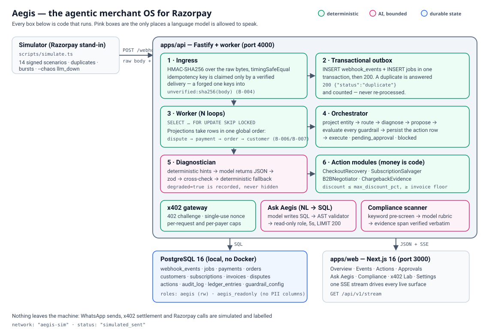

# Aegis — The Agentic Merchant OS for Razorpay

> **Razorpay AI Intern Buildathon 2026** · Open Track (Revenue Recovery · Growth & Agentic Commerce · Risk · Finance Controller) · by **Nabhanyu**

A merchant's Razorpay webhook stream is a list of things that went wrong: a 3DS decline at 2 a.m., a subscription that stopped renewing, a B2B invoice that quietly expired, a chargeback with a 7-day clock on it. Somebody has to read all of it, decide what each one means, and do something before the money is gone.

**Aegis reads the stream, decides, and acts — with a hard line drawn through the middle of the system.** Language understanding is the model's job. Money is not. Every rupee, every retry count, every discount, every deadline is computed in TypeScript, unit-tested, and only *then* handed to the model to write a sentence about. Every action that could move money or message a customer exists as a database row — with every guardrail it passed *and* every one it failed — before it is allowed to execute.

**→ If you read one section, read [What Broke at 2 AM & How I Got Out](#-what-broke-at-2-am--how-i-got-out).** That is where the engineering is.

---

## The system



Signed webhook → verified ingress → transactional outbox → worker with a fixed lock order → orchestrator → guard-railed action modules → audit trail and ledger → a dashboard that reads it all back over one SSE stream. PostgreSQL 16 on bare metal. No Docker, no hosted queue, no BaaS. `Architecture.md` is the long version.

## Quickstart (Ubuntu 24.04, five commands)

```bash
sudo bash scripts/bootstrap-system.sh   # 1. one-time, needs sudo: PostgreSQL 16 + roles + databases
bash scripts/setup.sh                   # 2. Node 24 via nvm, pnpm, .env, deps, migrations, seed
pnpm dev                                # 3. API :4000 · dashboard :3000
pnpm demo                               # 4. the whole story, narrated, in under two minutes
xdg-open http://localhost:3000          # 5. watch it fill in live while the demo runs
```

`pnpm demo` assumes the servers from step 3 are already up; it starts nothing itself. `--fast` drops the pauses, `--no-seed` keeps your data, `--allow-quiet-hours` temporarily widens the customer messaging window through the public guardrail API (announced on screen, audited, restored on exit) so a recording made at 3 a.m. can still show a message going out.

Without PostgreSQL the API still boots and reports `{"status":"degraded","db":"unavailable"}` — the dashboard shows the outage instead of a blank page.

---

# 🔥 What Broke at 2 AM & How I Got Out

Five failures that every test in the repo was already passing through. Each one is a row in `Bug-Feature.md` with a red-green regression test; the full incident log is the "2 AM log" at the bottom of that file.

### 1 · An unsigned request could permanently delete a real payment · `B-004`

**What broke.** The webhook ingress passed all 27 of its own tests and still had this hole: `POST` a payload with a *forged* signature naming `evt_X` → `401`, correctly. Then Razorpay's *genuine* `evt_X` arrives → `200 {"status":"duplicate"}`, zero jobs enqueued, the attacker's payload sitting in the row. A `200` tells Razorpay not to retry. **The event was not delayed. It was gone.** One `curl` per event id and a merchant silently stops recovering revenue.

**Why the tests missed it.** They covered *a* bad signature and *a* good signature. Never a bad one followed by a good one **with the same id**. The idempotency key and the authentication check were sharing a namespace, and the header was read *before* the HMAC was verified — so `event_id` was attacker-controlled at the moment of the upsert.

**How I got out.** The question that found it was "*who controls `event_id` at the moment of the `INSERT`?*" — answer: anyone with `curl`. Rejected deliveries now key into a namespace the attacker cannot reach: `unverified:<sha256(raw body)>`. The trusted key space is writable only by someone holding the webhook secret.

```
ingressKey(claimedEventId, sha256, signatureValid)   apps/api/src/ingress/razorpay-webhook.ts:57-68
```

Verified live: forged delivery → row `unverified:4fbe5753…`, 0 jobs; `evt_live_victim` → accepted, `process_event:evt_live_victim` enqueued. Red-green proved by reverting `ingressKey` alone (1 failed / 9 passed) and restoring it (10 passed). `C-C1` now states the invariant so no future ingress path can merge the namespaces again.

### 2 · Two workers deadlocking on the single most common Razorpay event pair · `B-006` → `B-007`

**What broke.** `order.paid` and `payment.captured` for the same order arrive together — that is the *normal* case, not an edge case. With `WORKER_CONCURRENCY=4` the two projections killed each other's transactions (`40P01`), PostgreSQL aborted one, the job retried after a full backoff, and nothing in its final state said it had happened. It looked like latency.

**Diagnosis.** ABBA lock-order inversion. `projectOrder` took `orders FOR UPDATE` then upserted `customers`; `projectPayment`'s `ensureOrder` upserted `customers` then took `orders FOR UPDATE`. Two paths, opposite order, same two rows.

**Then the fix was wrong.** Ordering the locks fixed it only for rows that *already existed*. A contended-burst run then exposed the cold-start case: **`SELECT … FOR UPDATE` on a row that does not exist takes no lock at all.** So during the window before an order first appears, one transaction could hold an uncommitted order row while the sibling payment path walked past it to `customers` — and the ABBA cycle was back. The worker still hid it behind a retry (`attempts=2`).

**How I got out.** `lockOrderSlot` reserves the identity instead of assuming it: it locks the existing order *or inserts a NULL-customer placeholder*, so the slot is taken before either path can reach `customers`. `projectOrder` fills its own placeholder in place.

```
apps/api/src/orchestrator/projections/shared.ts:lockOrderSlot
```

The global order — `dispute → payment → order → customer` — is now written into `C-C3` as a rule every future projection must extend and never invert. Proof needed a *contended* burst: `--burst N` builds N **distinct** events, so `max(attempts)=1` on it proved nothing. `--contend` aims every event at one order and one customer, which is the only run that could have failed.

### 3 · Two finished features that were dead in the browser · `B-016`, `B-017`

Both passed every server-side test. Both were completely broken for an actual user.

**Guardrail edits.** Clicking Save on `/settings` reported *"the API is unreachable"* — while the identical `PUT` from `curl` worked perfectly. It was CORS: `@fastify/cors` was registered with only an `origin`, so the preflight answered `access-control-allow-methods: GET, HEAD, POST` and **the browser refused to send the `PUT` before it ever left the tab**. The same omission hid `X-PAYMENT-RESPONSE` from the x402 Lab, because it is not a CORS-safelisted response header — `response.headers.get()` returned `null` in the browser while `curl` showed the receipt.

**The kill switch.** Flipping it changed the database and *no dashboard noticed*. `approvalRoutes` publishes `system.kill_switch` through an optional bus, and `app.ts` registered the plugin without one — so `options.bus?.publish(...)` was a silent no-op. `C-B5` requires the stop to reach every consumer within one poll cycle; optional chaining had quietly turned a safety signal off.

**How I got out.** Explicit `methods` and `exposedHeaders`; the shared bus passed to `approvalRoutes`. The lesson is in the tests now: *an optional dependency that silently disables a safety signal deserves a test that asserts the signal, not the call.* Browser verification became part of every frontend task — that is also how `B-015` (a crash on Acknowledge) and `B-018` (3.13:1 contrast on the dark-mode accent) were caught.

### 4 · The demo data could not reach the state the product was for · `B-014`

**What broke.** The approvals queue was empty no matter what the simulator sent, and every negotiation showed a **₹0** discount. Every unit test passed — because each one passes its own floor.

**Diagnosis.** `projectInvoice` inserts `floor_amount_paise = amount_paise`, and the simulator's B2B invoice fixture carried no merchant floor. So the negotiator had *exactly zero room*: its guarded offer was always "pay the full amount", the money impact was always 0, the action auto-approved, and the queue never filled. **The module's entire point — a bounded discount a human signs off on — was invisible, and nothing failed.**

**How I got out.** The merchant floor now comes from the invoice notes and the B2B fixture states one. The rule I wrote down: *a page that renders a state must be verified against data that can actually reach that state. "The queue is empty" is not evidence that the queue works.*

### 5 · The headline number was structurally pinned at zero · `B-019`

**What broke.** Building this demo, I checked the ledger: **23 executed recovery actions, and not one `recovered_revenue` row.** `money.recovered_paise` was ₹0 and always had been. In a Revenue Recovery submission that is the one number that matters.

**Diagnosis.** Not the attribution logic — the clock. The simulator stamped every fixture with a frozen constant, `1_757_000_000`, which is **2025-09-04**. Deliveries were arriving with `rzp_created_at` a year in the past while actions executed at wall-clock now:

```
rzp_created_at  2025-09-04 21:03:33+05:30
received_at     2026-09-06 07:32:55+05:30
```

`attributeRecovery` requires `executed_at <= capturedAt` inside the attribution window. An action executed a year *after* the capture it is supposed to belong to can never match. No error, no warning — the join simply returned nothing, forever. Every time-relative rule downstream (24-hour prior-failure counts included) had been quietly deciding on year-old input.

**How I got out.** A live delivery now carries a live timestamp; `--created-at` pins it when a run must be byte-reproducible. And because a standalone capture invents fresh entity ids that match nothing, `--order` / `--customer` let the retry name the failure it is recovering. `pnpm demo` waits for the recovery action to actually reach `executed`, *then* fires the capture:

```
→ recovery action executed: whatsapp_cart_nudge, expected recovery 79900 paise
   recovered_revenue | 1 | 79900        ← the first one this system ever produced
```

Same class as #4, and the reason both are in this list: **a green test suite tells you the code does what you wrote. It does not tell you the system can reach the state you built it for.**

*Also found while writing this demo: `pnpm x402:buy` never loaded `.env` and signed a `payTo` it guessed from its own environment instead of the one the 402 challenge quoted, so every agent purchase failed `bad_signature` the moment the real secret differed from the placeholder (`B-020`).*

---

## Bring your own keys (Sandbox / Live mode)

Every page runs in **Demo mode** by default: the simulator signs deliveries with the deployment's webhook secret and every model call uses the key in `.env`. The key-shaped pill in the top bar opens **Sandbox & keys**, where **Live mode** takes three values:

| Value | Where it goes | What it does |
|---|---|---|
| Razorpay account id | `POST /api/v1/sandbox/keys` once, stored as `guardrail_config.sandbox_secret_<account_id>` | names the secret the ingress verifies that account's deliveries with |
| Razorpay webhook secret | same request; never returned, only its fingerprint | `POST /webhooks/razorpay` reads `account_id` out of the raw bytes, looks the secret up, and runs the HMAC over the unaltered body with it (the `.env` secret is the fallback, not a second chance) |
| OpenAI API key (optional) | this browser only; sent as `x-aegis-llm-key` on every request | Ask Aegis and a manual compliance scan run on your key against api.openai.com — never the deployment's proxy — with their own retry budget and breaker; a bad key degrades only your requests |

The secret is invisible to the settings page and to the read-only role model-authored SQL runs as (row-level security, migration 0005). **The control plane itself is still unauthenticated** — like guardrail edits and approvals, this route trusts whoever can reach the API port — so keep the API on a private network until F-028 (authentication + tenant ownership) lands. `AEGIS_LLM_PROVIDER=stub` still wins over a browser key, and the model id comes from `OPENAI_MODEL`, so a deployment pinned to a proxy-only model id needs a public one for Live mode to complete a call.

## The AI boundary

The single design rule: **the model is allowed to read language and pick from a closed set. It is never allowed to compute a number or decide control flow.**

| Capability | Who does it | Why |
|---|---|---|
| Signature, dedupe, routing | **deterministic** | correctness and security cannot be probabilistic |
| Entity projection, status precedence | **deterministic** | ledger-grade state |
| Payment-failure hints (`error_step`, `international`, `method`) | **deterministic** | the structured fields already tell most of the story |
| Root-cause narrative + intervention **chosen from an enum** | **LLM** → zod → cross-check | free-text `error_description` is a language problem |
| Locale, template and retry-link selection | **deterministic** | regulated channels use pre-approved templates only |
| Discount amount, floor, rounds, budgets | **deterministic** | **never AI for money or math** |
| B2B negotiation wording | **LLM** (text only; numbers injected by code) | persuasion is language |
| Evidence packet fields / narrative | **deterministic** / **LLM** | facts from the DB; summarisation from the model |
| Approval decisions | **human** | gated by design |
| Text-to-SQL | **LLM** → AST validator → read-only role | code-gen is language; execution is sandboxed |
| Forecast numbers | **deterministic** (regression + moving average in TS) | never AI for math |
| Compliance classification | keyword pre-screen + **LLM** rubric + evidence-span verification | unstructured text |
| x402 challenge / verify / settle | **deterministic** | money |

Five constraints hold that line, and the Verification Agent rejects any task that breaks one: no LLM arithmetic (`C-A1`), no LLM control flow (`C-A2`), no unchecked classification (`C-A3`), **no dependency on the model being up** (`C-A4`), and no LLM call inside a transaction holding row locks (`C-A6`). All 30 `SELECT … FOR UPDATE` sites were read to confirm the last one.

## The honest scoreboard

`GET /api/v1/metrics/summary` — every field aggregates independently from source rows, so no number is derived from another number. A real snapshot from a demo run on 2026-09-06:

```json
"actions": { "proposed": 83, "blocked": 46, "pending_approval": 4, "executed": 32, "rejected": 1 },
"money":   { "recovered_paise": 159800, "x402_revenue_paise": 848400 },
"humans":  { "reviewed": 3, "approved": 2, "rejected": 1, "rejection_rate": 0.33 },
"llm":     { "calls": 68, "degraded": 24, "degraded_rate": 0.35, "avg_latency_ms": 10591 }
```

**The uncomfortable numbers are the point.**

- **`blocked: 46` against `executed: 32`.** More than half of everything Aegis proposed was stopped by its own guardrails — quiet hours, the daily discount budget, the auto-approve ceiling. That ratio is the product working, not failing.
- **`rejection_rate: 0.33`.** One in three human reviews was a *rejection*. Aegis proposes; it is wrong sometimes; the number is on the dashboard.
- **`degraded_rate: 0.35`.** Roughly a third of model calls fell back to deterministic rules — the provider proxy behind this build answers `503` for several model ids, and the circuit breaker opens. **Every one of those events still produced a bounded, audited action.** That is `C-A4` in production, and the dashboard says "degraded" rather than pretending.
- **`recovered_paise`** counts only captures attributed to an action that actually executed, once, inside the window — deduplicated by a unique ledger constraint, not by a `COUNT`.

Run `AEGIS_CHAOS=llm_down pnpm sim payment_failed_3ds_intl` to see the degraded path on demand.

## What `pnpm demo` shows (1 min 50 s)

| # | Step | What it proves |
|---|---|---|
| 1–2 | seed + start the catalog compliance scan | 16 products, one model call each; the control plane answers `202` and works in the background |
| 3 | 3DS decline delivered **four times** | 1 accepted + 3 duplicate — idempotency, and only a signed delivery may claim a key (`B-004`) |
| 4 | UPI cart drop-off, pinned to one customer | the customer followed to the end of the story |
| 5 | subscription halted | dunning schedule 24h/72h/168h, then it stops — in code, not a prompt |
| 6 | B2B invoice expired | the demo **reads the action back**: `blocked · money impact ₹21000 · bound hit: daily_discount_budget_paise` |
| 7 | chargeback opened | `pending_approval` — evidence is never auto-submitted (`C-B4`) |
| 8–9 | x402 purchase, then replay | `402` → signed `200` + `X-PAYMENT-RESPONSE` → `nonce_already_settled` |
| 10 | the customer retries and pays | waits for the recovery action to reach `executed`, then attributes the capture to it |
| 11 | compliance findings | every flag quotes a span that exists verbatim in the product copy |
| 12 | metrics summary | including the bad numbers |
| 13 | `AEGIS_CHAOS=llm_down` | `degraded=true` recorded, action still bounded and audited |

Shot list with timestamps: `docs/video-storyboard.md`.

## Track mapping

| Track | What clears the bar |
|---|---|
| **Revenue Recovery** | measured money recovered (attributed once, to an executed action, inside a window), stopping rules in code, full audit trail |
| **Growth & Agentic Commerce** | bounded B2B discount negotiation with a human gate; an x402 gateway that sells to AI buyers with single-use nonces and per-payer caps |
| **Risk** | chargeback evidence that a human must approve; a compliance scanner whose every claim quotes verifiable product copy |
| **Finance Controller** | Ask Aegis (NL → validated SQL → read-only role with no PII columns), a deterministic forecaster, and a ledger that reconciles |

## What is simulated (and how honestly)

| Simulated | How | What is real |
|---|---|---|
| Razorpay webhooks | `scripts/simulate.ts` builds payloads in Razorpay's documented shape and signs them with the same HMAC scheme | the ingress is the real thing — point real webhooks at it and it works |
| WhatsApp send | built in Meta Cloud API template shape, persisted and shown, **never sent** | template selection, localisation, cooldown and quiet-hour guardrails |
| x402 facilitator | locally HMAC-signed payments, server-issued nonces | the 402 challenge shape, replay protection, caps, ledger |
| Merchant catalog / customers | seeded rows | everything downstream |
| LLM | a `stub` provider replays fixtures when no key is present | the `anthropic` / `openai` adapters run for real when keys exist |

Every simulated payload is labelled in its own body — `network: "aegis-sim"`, `status: "simulated_sent"` (`C-B7`). Nothing in this repo can make an outbound call to a real customer.

## Verify it yourself

```bash
pnpm test          # 65 files · 326 tests
pnpm typecheck     # tsc --noEmit, strict, no `any` anywhere (C-E2)
pnpm lint          # three projects, --max-warnings 0
pnpm --filter @aegis/web build
pnpm sim --help    # 14 signed scenarios, duplicates, bursts, --contend, --chaos
```

## Repository map

| Path | What |
|---|---|
| `apps/api` | Fastify API + worker: ingress, orchestrator, modules, x402, NL query, compliance |
| `apps/web` | Next.js 16 dashboard, 11 routes + a component kitchen sink |
| `packages/shared` | domain enums, precedence rules, money helpers, Razorpay schemas, simulator fixtures |
| `db/` | 4 SQL migrations (each with a `.down.sql`) + seed |
| `scripts/` | bootstrap, setup, simulator, x402 buyer, `demo.sh` |
| `Architecture.md` `Flow.md` `Decisions.md` `Constraints.md` `Design.md` | the design |
| `Checklist.md` `TestChecklist.md` `Bug-Feature.md` `Rollback.md` | the process |
| `AGENTS.md` `CLAUDE.md` | rules for the agents that built this |

Aegis was built by a two-agent workflow: **Claude as Lead Technical Architect and Verification Agent**, **Codex as implementer**, one checklist task per handoff. Every decision, flow, constraint, test command and rollback path was written down before the code existed. The bugs in the section above were found by the verification pass, not by the test suite — which is exactly what the workflow was for.

---
Made with 💖 by Nabhanyu for Razorpay AI Buildathon
